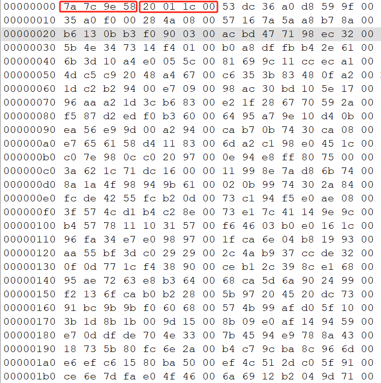

# PdbParse
应用层解析并下载当前OS的PDB符号文件,使用特定算法,压缩优化符号与偏移.

## 使用

```
1. 内核程序或应用层程序主动运行DumpSymbol.exe
2. 根据返回值判断是否下载成功
3. 下载成功后,DumpSymbol.exe会自动将PDB文件与压缩符号数据文件保存到特定目录下
4. 内核层读取压缩符号数据文件,并建立符号偏移映射表.
5. 所有的符号均通过CRC32计算后查询映射表,例如ComputeCrc32(L"ZwOpenProcess",wcslen(symbolName) * sizeof(wchar_t)).
6. 根据获取的偏移,经转换后为正确地址.
```

## 符号压缩算法

```
typedef struct symbol_info_t
{
	uint32_t checksum;	// ComputeCrc32(L"ZwOpenProcess",wcslen(symbolName) * sizeof(wchar_t))校验和
	uint32_t RetVal;	// 相对虚拟地址
};
```

